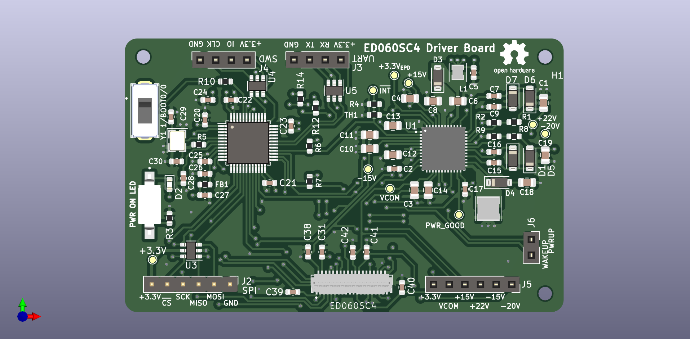
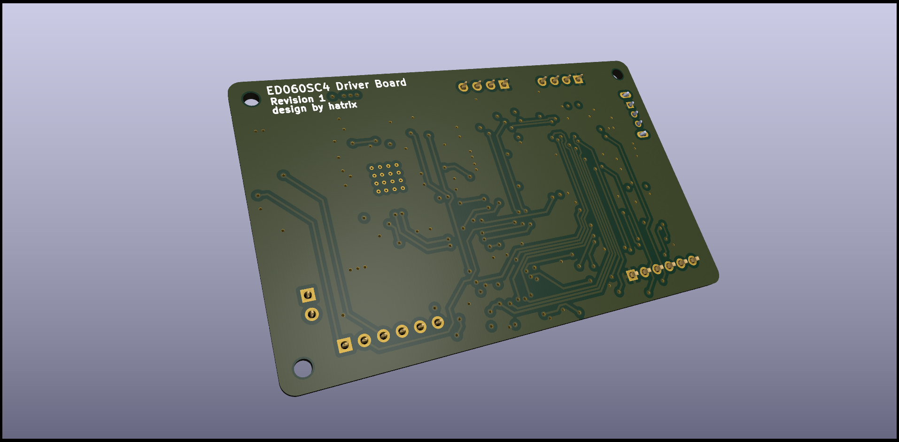

# ED060SC4 Driver Board

This projects intends to be a SPI driver board for the E-Ink display screen
`ED060SC4`.

This project is still under development, you can have a look at the schematics,
the PCB or the components, but it's not finished and will likely change!

## Schematics

The board is centered around 3 building blocks:

- ED060SC4, EPD screen
- STM32F103C8T6, microcontroller used to drive the screen
- TPS65185, used to generate the different rails required

The schematics can be found in [pdf](./outputs/schematics/ED060SC4_SPI_driver_board.pdf).

## Interactive Board

The PCB, nets and BOM can be seen in an [interactive html format](http://htmlpreview.github.io/?https://raw.githubusercontent.com/Mael-Le-Garrec/ED060SC4-Driver-Board-Hardware/master/outputs/html/ibom.html).

## Gerbers

The gerber files are available in a [zip archive](./outputs/gerbers/gerbers.zip)
ready to be sent for manufacturing.

## Images

